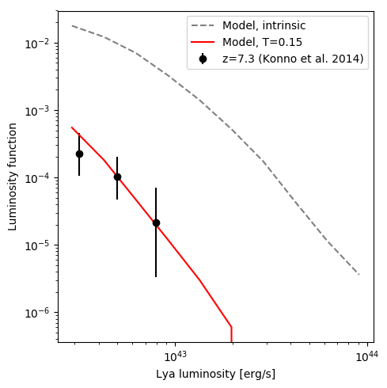

# Example

An example script, [example.py](./example.py), is provided that uses **slap** to generate an LAE population at z=7.3, to compare with the observational data from [Konno et al. (2014)](https://doi.org/10.1088/0004-637X/797/1/16). Having installed the dependencies (e.g. by following the instructions in [SETUP](SETUP.md)) you can run this example to generate a plot of the luminosity function:

```
$ python example.py
```
If the code runs it should produce output similar to the following plot ([example.png](./example.png)):



## Using `LAEModel`
To create an LAE population you need to provide 5 things:

1. redshift (`z`)
2. duty cycle parameter (`delta_t`)
3. halo masses of the underlying dark matter population (`halo_mass`)
4. observational minimum Lya REW (`rew_min`)
5. observational minimum Lya luminosity (`lya_min`)

You can then create the population by constructing the `LAEModel` object:

```
lae_pop = LAEModel(z, delta_t, halo_mass, rew_min, lya_min)
```
From this object you can access the following attributes:
- `halo_ids`: the IDs of the halos (from the initial halo population) that host LAEs
- `halo_mass`: the masses of the LAE host halos
- `uv_lum`: the UV magnitudes of the LAEs
- `lya_lum`: the intrinsic Lya luminosity of the LAEs
- `lya_rew`: the intrinsic Lya REW of the LAEs

Note: this generates the _intrinsic_ LAE population, it does not account for e.g. IGM attenuation of the Lya radiation.
In [example.py](example.py), we try a toy model in which only 20% of the emission survives the IGM for **every** LAE (regardless of luminosity, mass etc.).

```
t_igm = 0.2
lya_lum = t_igm * lae_pop.lya_lum
```

## Issues
Recent versions of `hmf` raise the following warning:
```
 warnings.warn("hmf is un-tested for redshifts greater than 2 and extreme masses. See https://github.com/steven-murray/HMFcalc/issues/6 for details.")
```
The warning suggests that the default choice of CAMB parameters used in `MassFunction` may not be applicable to higher redshifts or lower halo masses, first raised as issue [hmf:#6](https://github.com/steven-murray/HMFcalc/issues/6). See issue [slap:#1](https://github.com/lewis-weinberger/slap/issues/1) for further details.

Note these warnings can be suppressed by running with the `-W ignore` flag:
```
$ python -W ignore example.py
```